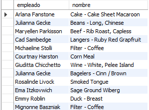
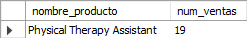

# Reto 2

### Obtener el puesto de un empleado.

```
CREATE VIEW reto2_q1_490 AS (
SELECT concat(e.nombre, ' ', e.apellido_paterno) AS nombre_empleado, p.nombre AS nombre_producto
FROM empleado AS e
JOIN puesto as p
	ON e.id_puesto = p.id_puesto);

SELECT * FROM reto2_q1_490;
```


### Saber qué artículos ha vendido cada empleado.

```
CREATE VIEW reto2_q2_490 AS (
SELECT v.clave, concat(e.nombre, ' ', e.apellido_paterno) AS nombre_empleado, a.nombre AS nombre_articulo
FROM empleado AS e
JOIN venta as v
	ON e.id_empleado = v.id_empleado
JOIN articulo AS a
	ON v.id_articulo = a.id_articulo);

SELECT * FROM reto2_q2_490;
```



### Saber qué puesto ha tenido más ventas.

```
CREATE VIEW reto2_q3_490 AS (
SELECT p.nombre AS nombre_puesto, COUNT(DISTINCT v.clave) AS num_ventas
FROM puesto AS p
JOIN empleado AS e
	ON e.id_puesto = p.id_puesto
JOIN venta AS v
	ON v.id_empleado = e.id_empleado
GROUP BY p.nombre
ORDER BY num_ventas DESC);

SELECT * FROM reto2_q3_490
LIMIT 1;
```


