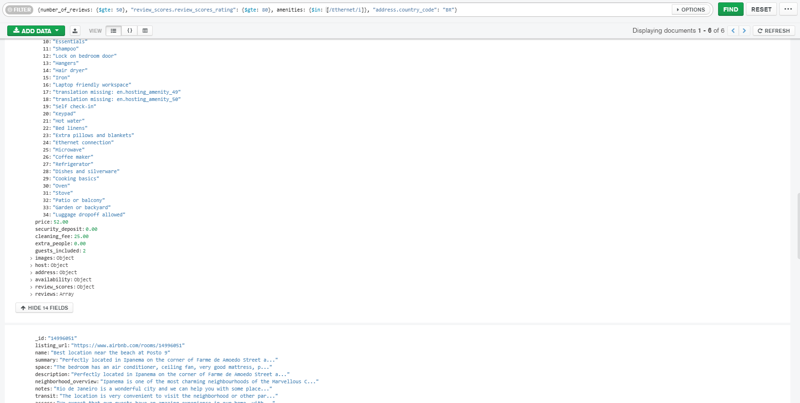

# Reto 2

Mongo shell
```
use sample_airbnb
```

### Usando la colección sample_airbnb.listingsAndReviews, agrega un filtro que permita obtener todas las publicaciones que tengan 50 o más comentarios, que la valoración sea mayor o igual a 80, que cuenten con conexión a Internet vía cable y estén ubicada en Brazil.
Mongo shell
```
db.listingsAndReviews.find({number_of_reviews: {$gte: 50}, "review_scores.review_scores_rating": {$gte: 80}, amenities: {$in: [/Ethernet/i]}, "address.country_code": "BR"})
```

