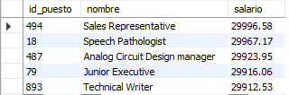

# Reto 3

### Usando la base de datos `tienda`, escribe una consulta que permita obtener el top 5 de puestos por salarios.

#### Query
```
SELECT *
FROM puesto
ORDER BY salario DESC
LIMIT 5;
```

#### Result

