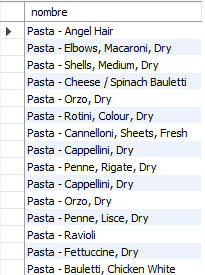
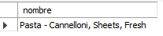
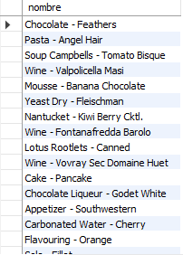

# Reto 1

### ¿Qué artículos incluyen la palabra Pasta en su nombre?

```
SELECT nombre
FROM articulo
WHERE nombre LIKE '%Pasta%';
```




### ¿Qué artículos incluyen la palabra Cannelloni en su nombre?

```
SELECT nombre
FROM articulo
WHERE nombre LIKE '%Cannelloni%';
```



### ¿Qué nombres están separados por un guión (-) por ejemplo Puree - Kiwi?

```
SELECT nombre
FROM articulo
WHERE nombre LIKE '%-%';
```


