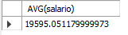
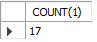
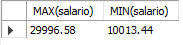
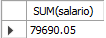

# Reto 2

### ¿Cuál es el promedio de salario de los puestos?

```
SELECT AVG(salario)
FROM puesto;
```

```
SELECT SUM(salario) / COUNT(salario)
FROM puesto;
```




### ¿Cuántos artículos incluyen la palabra Pasta en su nombre?

```
SELECT COUNT(1)
FROM articulo
WHERE nombre LIKE '%Pasta%';
```



### ¿Cuál es el salario mínimo y máximo?

```
SELECT MAX(salario), MIN(salario)
FROM puesto;
```



### ¿Cuál es la suma del salario de los últimos cinco puestos agregados?

```
SELECT SUM(salario)
FROM (SELECT salario
  FROM puesto
  ORDER BY id_puesto DESC
  LIMIT 5) AS subSalarios;
```


