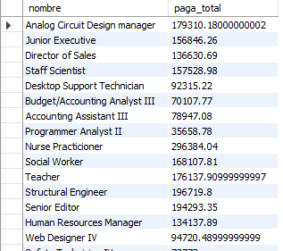
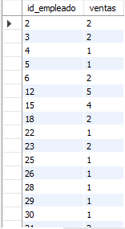
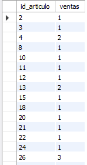

# Reto 3

### ¿Cuántos registros hay por cada uno de los puestos?

```
SELECT nombre, COUNT(*) AS registros
FROM puesto
GROUP BY nombre;
```


### ¿Cuánto dinero se paga en total por puesto?

```
SELECT nombre, SUM(salario) AS paga_total
FROM puesto
GROUP BY nombre;
```



### ¿Cuál es el número total de ventas por vendedor?

```
SELECT id_empleado, COUNT(id_venta) AS ventas
FROM venta
GROUP BY id_empleado;
```



### ¿Cuál es el número total de ventas por artículo?

```
SELECT id_articulo, COUNT(id_venta) AS ventas
FROM venta
GROUP BY id_articulo;
```


