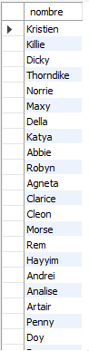
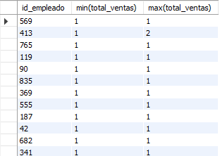
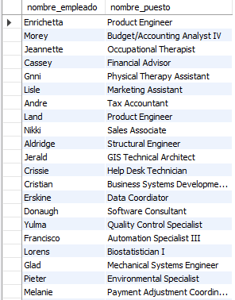

# Reto 4

### ¿Cuál es el nombre de los empleados cuyo sueldo es menor a $10,000?

```
SELECT nombre
FROM empleado
WHERE id_puesto IN
	(SELECT id_puesto FROM puesto WHERE salario > 10000);
```




### ¿Cuál es la cantidad mínima y máxima de ventas de cada empleado?

```
TODO
```



### ¿Cuál es el nombre del puesto de cada empleado?

```
SELECT nombre AS nombre_empleado, (SELECT nombre FROM puesto WHERE id_puesto = e.id_puesto) AS nombre_puesto
FROM empleado AS e;
```


