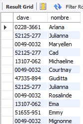
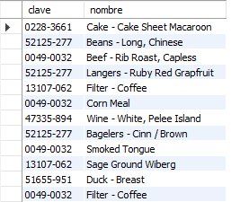
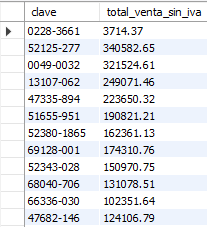
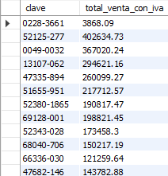

# Reto 1


### ¿Cuál es el nombre de los empleados que realizaron cada venta?

```
SELECT v.clave, e.nombre
FROM empleado AS e
JOIN venta AS v
	ON e.id_empleado = v.id_empleado;
```




### ¿Cuál es el nombre de los artículos que se han vendido?

```
SELECT v.clave, a.nombre
FROM articulo AS a
JOIN venta AS v
	ON a.id_articulo = v.id_articulo;
```



### ¿Cuál es el total de cada venta?

#### Sin IVA
```
-- Sin IVA
SELECT v.clave, ROUND(SUM(a.precio), 2) AS total_venta_sin_iva
FROM articulo AS a
JOIN venta AS v
	ON a.id_articulo = v.id_articulo
GROUP BY v.clave;
```


#### Con IVA
```
-- Con IVA
SELECT v.clave, ROUND(SUM(a.precio + a.iva), 2) AS total_venta_con_iva
FROM articulo AS a
JOIN venta AS v
	ON a.id_articulo = v.id_articulo
GROUP BY v.clave;
```


