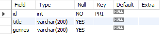
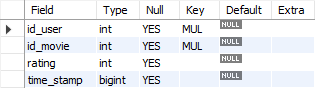

# Reto 1

### Definir los campos y tipos de datos para la tabla `movies` haciendo uso de los archivos `movies.dat` y `README`.

```
DESCRIBE movies;
```




### Crear la tabla `movies` (recuerda usar el mismo nombre del archivo sin la extensión para vincular nombres de tablas con archivos).

```
CREATE TABLE IF NOT EXISTS movies (
	id INT PRIMARY KEY,
    title VARCHAR(200),
    genres VARCHAR(200)
);
```


### Definir los campos y tipos de datos para la tabla `ratings` haciendo uso de los archivos `ratings.dat` y `README`.

```
DESCRIBE ratings;
```


### Crear la tabla `ratings` (recuerda usar el mismo nombre del archivo sin la extensión para vincular nombres de tablas con archivos)

```
CREATE TABLE IF NOT EXISTS ratings (
    id_user INT NOT NULL,
    id_movie INT NOT NULL,
    rating INT,
    time_stamp BIGINT,
    FOREIGN KEY (id_user) REFERENCES users(id),
    FOREIGN KEY (id_movie) REFERENCES movies(id)
);
```

