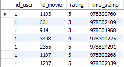

# Reto 2

### Usando como base el archivo `movies.dat`, limpiarlo e importar los datos en la tabla `movies` creada en el Reto 1.

```
SELECT *
FROM movies
LIMIT 10;
```


### Usando como base el archivo `ratings.dat`, limpiarlo e importar los datos en la tabla `ratings` creada en el Reto 2.

```
SELECT *
FROM ratings
LIMIT 10;
```


