# Ejercicios

Mongo Shell
```
use sample_training
```

1. Obtén los datos de contacto de cada compañía.

  Mongo Shell
  ```
  db.companies.find({}, {email_address: 1, phone_number: 1})
  ```
  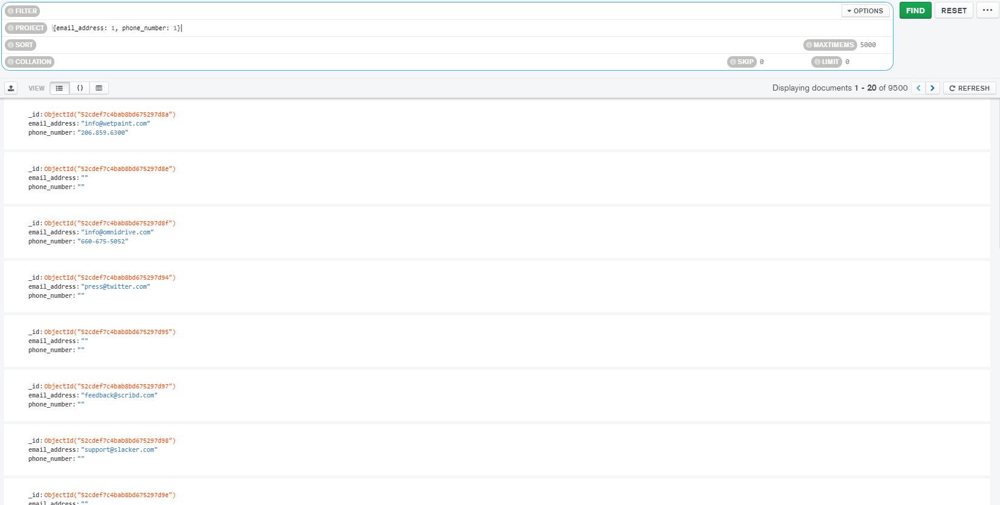

2. Obtén el identificador de la clase de cada calificación.

  Mongo Shell
  ```
  db.grades.find({}, {class_id: 1})
  ```
  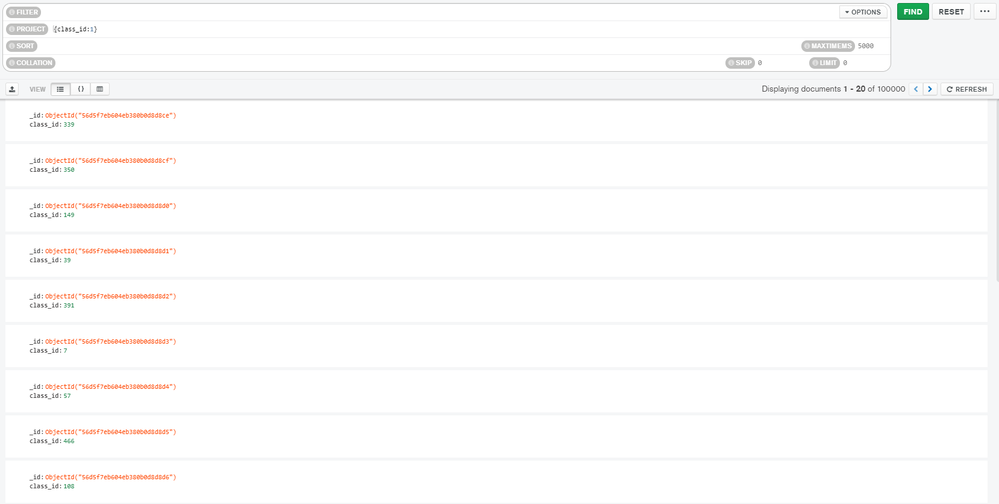

3. Obtén el nombre de todas las compañias fundadas en octubre.

  Mongo Shell
  ```
  db.companies.find({founded_month: 10})
  ```
  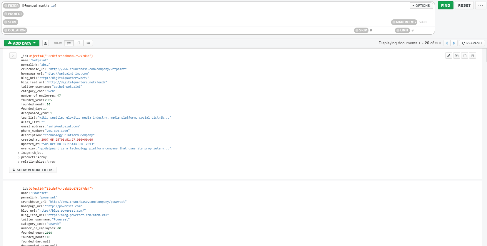

4. Obtén el nombre de todas las compañías fundadas en 2008.

  Mongo Shell
  ```
  db.companies.find({founded_year: 2008})
  ```
  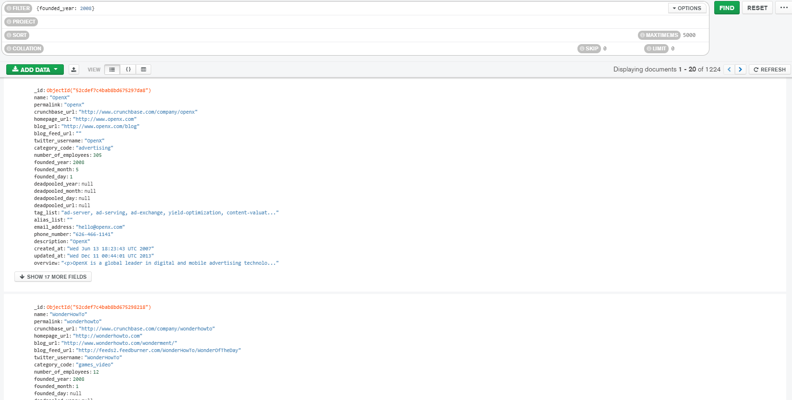

5. Obtén todos los *post* del autor `machine`.

  Mongo Shell
  ```
  db.posts.find({author: "machine"}, {title: 1, author: 1, body: 1})
  ```
  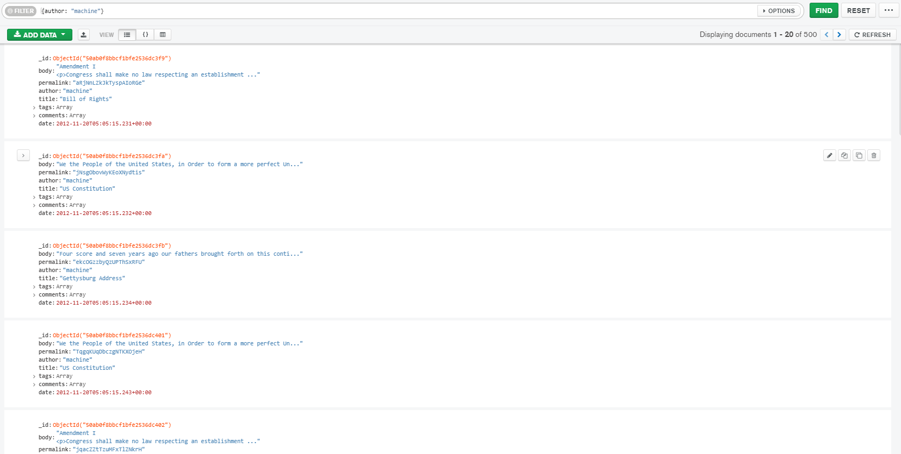

6. Obtén todas las calificaciones provenientes de los grupos `357`, `57` y `465`.

  Mongo Shell
  ```
  db.grades.find({class_id: {$in: [357, 57, 465] }})
  ```
  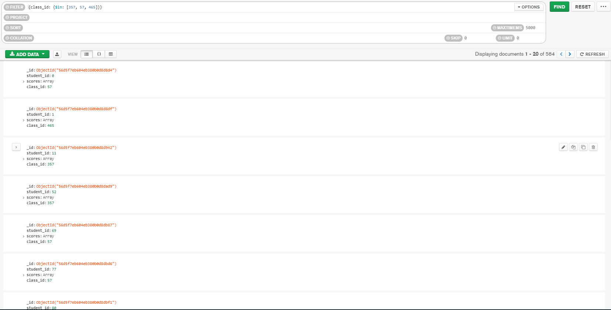

7. Obtén todas las compañías fundadas en octubre del 2008.

  Mongo Shell
  ```
  db.companies.find({$and: [{founded_year: 2008}, {founded_month: 10}] })
  ```
  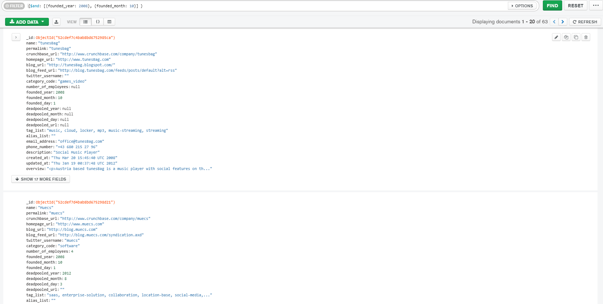

8. Obtén todas las compañias con más de 50 empleados.

  Mongo Shell
  ```
  db.companies.find({number_of_employees: {$gt: 50}})
  ```
  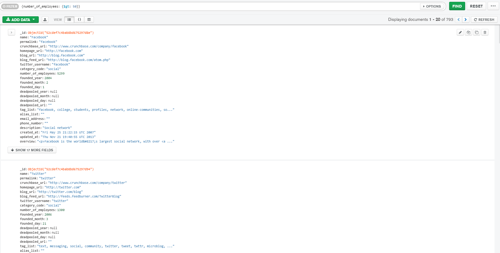

9. Obtén las rutas con un número de paradas entre 1 y 5.

  Mongo Shell
  ```
  db.routes.find({$and: [{stops: {$gte: 1}}, {stops: {$lte: 5}}]})
  ```
  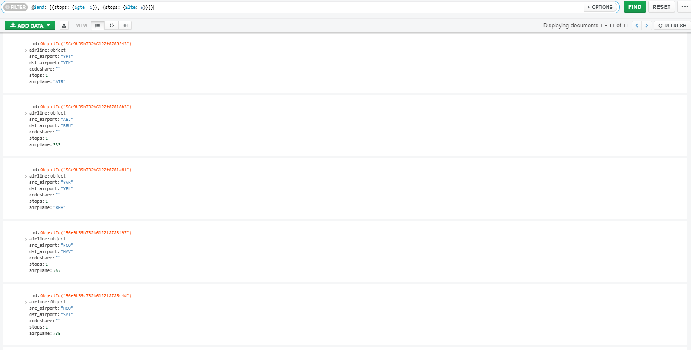

10. Obtén la empresa con el menor número de empleados.

  Mongo Shell
  ```
  db.companies.find({number_of_employees: {$ne: null}}).sort({number_of_employees: 1}).limit(1)
  ```
  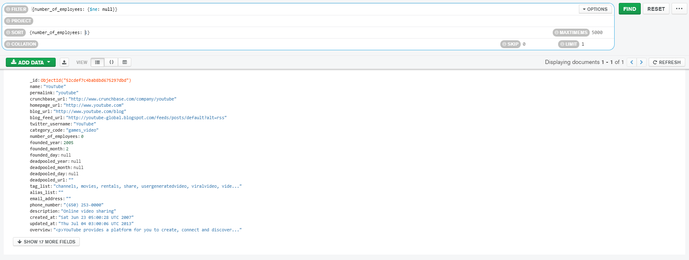

11. Obtén la empresa con el mayor número de empleados.

  Mongo Shell
  ```
  db.companies.find({number_of_employees: {$ne: null}}).sort({number_of_employees: -1}).limit(1)
  ```
  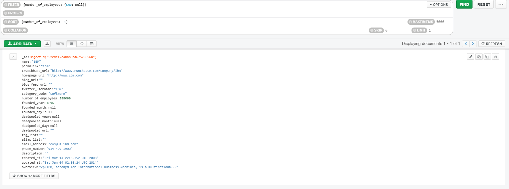

12. Obtén el viaje con mayor duración.

  Mongo Shell
  ```
  db.trips.find().sort({tripduration: -1}).limit(1)
  ```
  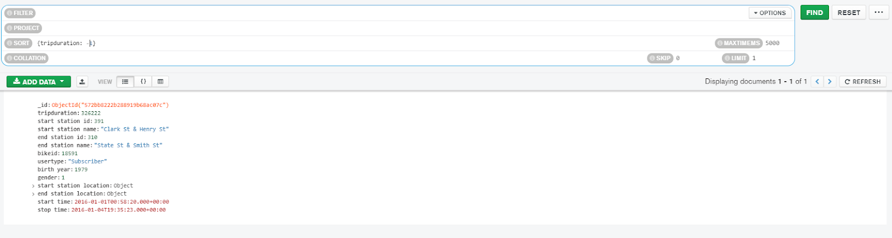

13. Obtén el viaje con menor duración.

  Mongo Shell
  ```
  db.trips.find().sort({tripduration: 1}).limit(1)
  ```
  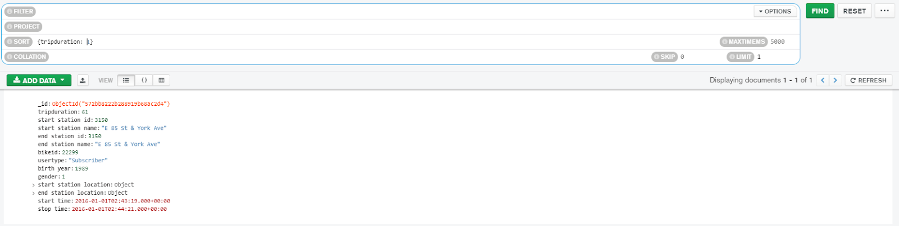
