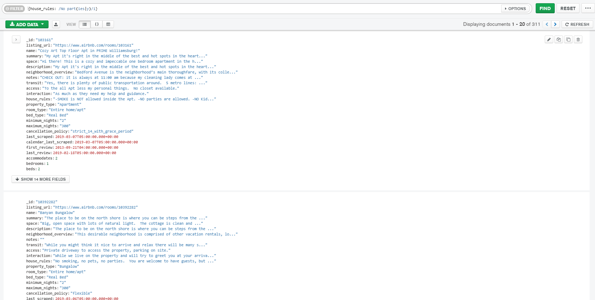
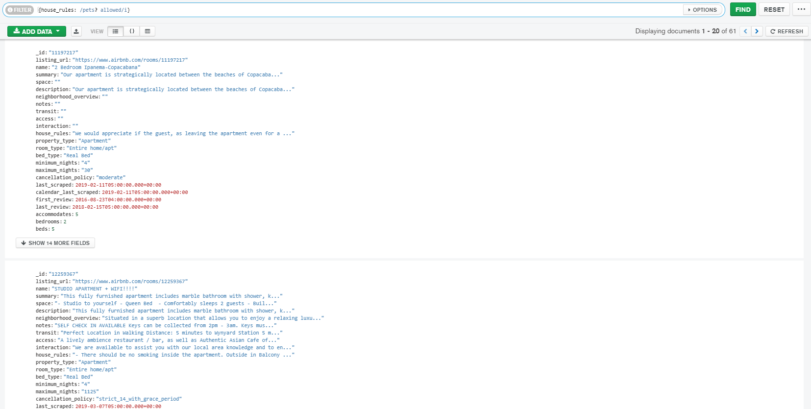
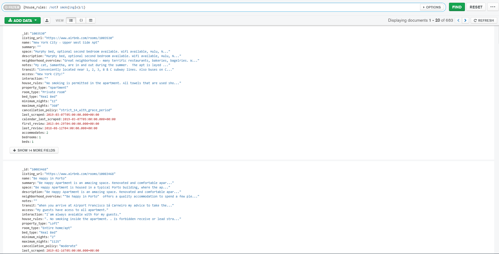
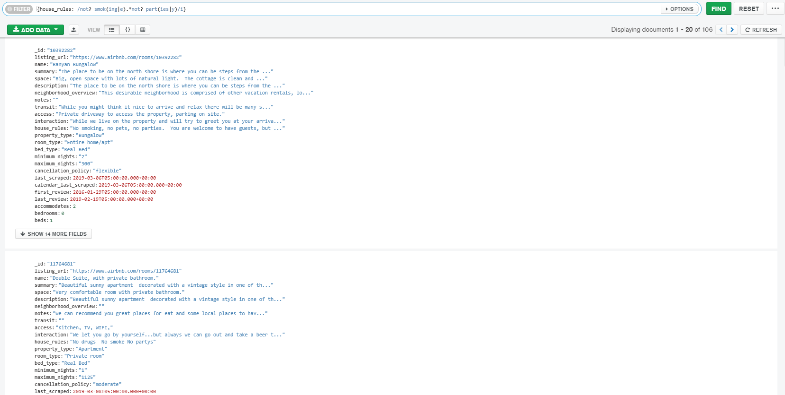

# Reto 1

Mongo shell
```
use sample_airbnb
```

### Propiedades que no permitan fiestas.
Mongo shell
```
db.listingsAndReviews.find({house_rules: /Not? part(ies|y)/i})
```


### Propiedades que admitan mascotas.
Mongo shell
```
db.listingsAndReviews.find({house_rules: /pets? allowed/i})
```


### Propiedades que no permitan fumadores.
Mongo shell
```
db.listingsAndReviews.find({house_rules: /not? smok(ing|e)/i})
```


### Propiedades que no permitan fiestas ni fumadores.
Mongo shell
```
db.listingsAndReviews.find({house_rules: /not? smok(ing|e).*not? part(ies|y)/i})
```

